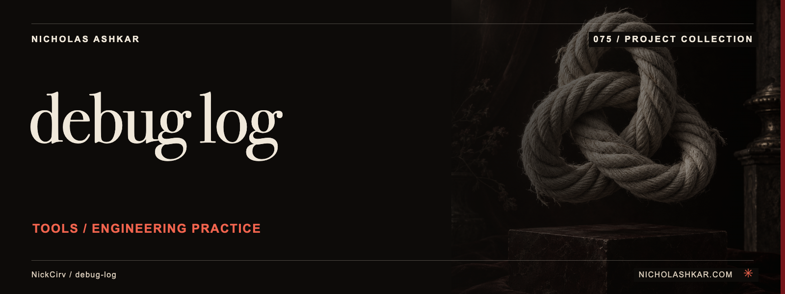

# debug-log

Provides a namespaced JavaScript logger and a CLI for reading structured log files.


<a id="usage"></a>

<a id="view-a-log-file"></a>

<a id="tail-live-with-filters"></a>

<a id="stats-error-rate-top-namespaces-busiest-hour"></a>

<a id="text-search"></a>

## What it does

- CreateLogger API.
- Levels and namespace filtering.
- Bound context and timers.
- Configurable formatting/redaction.
- JSON log viewer.


<a id="install"></a>

## Quickstart

Prerequisites: Node.js `>=20` and npm. The checkout below pins the source used for this documentation.

```sh
git clone https://github.com/NickCirv/debug-log.git
cd debug-log
git checkout d7f39a7057383fa14fc54f37bdbee327ce4d9879
node cli.js --help
```

**Expected behavior (illustrative, not captured):** Shows log viewing, searching and statistics commands; the integration example below demonstrates the library API.

For a direct local integration, save this as `example.mjs` in the checkout and run `DEBUG=example node example.mjs`:

```js
import { createLogger } from "./index.js";
const log = createLogger("example", { format: "json", redact: ["token"] });
log.info("Import completed", { rows: 2, token: "example-only" });
```

This illustrates a structured event and configured key redaction; it was not executed in this review.

Examples are source-inspected, **not runtime-tested**. See the research record for verification gaps.

## Boundaries and data

Redaction only covers configured keys and is not a complete secret detector. Logging can write sensitive context to stdout or an optional JSON file. DEBUG and LOG_LEVEL filters affect emitted messages.

## Development

The manifest defines `npm test` as:

```sh
node --test
```

The captured suite is a smoke check, not end-to-end behavior coverage. Examples include “entry is valid JavaScript”. Tests were not run for this documentation revision.

See [implementation and command reference](docs/REFERENCE.md) for the package scripts and inspected interfaces, and [research record](docs/RESEARCH.md) for the pinned source, document decisions and unresolved checks.

## License and contact

See [LICENSE](LICENSE) for the original terms and attribution. Legal text is unchanged.

[Nicholas Ashkar](https://nicholashkar.com/) · [Discuss a project](https://nicholashkar.com/#oxblood-contact)
